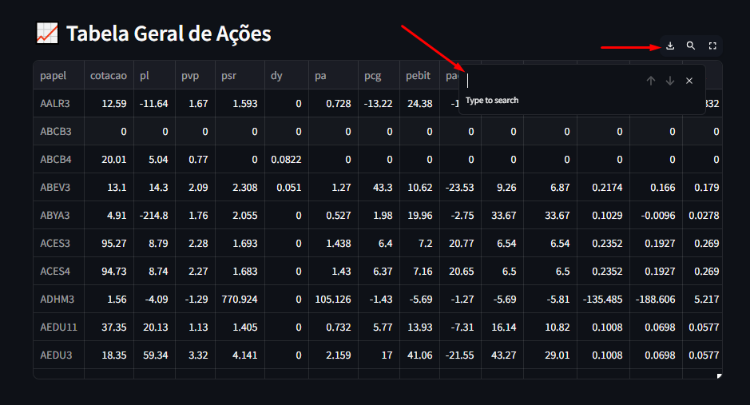
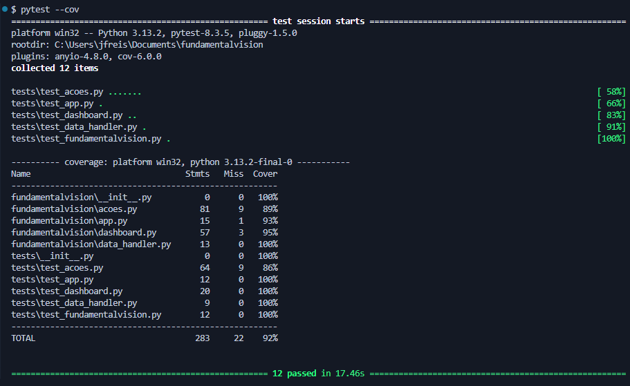

# Complete Guide to Using the FundamentalVision Application

Welcome to the complete guide for using the FundamentalVision application, a tool for fundamental analysis of stocks on Brazil's B3 stock exchange. This guide will walk you through the installation, configuration, and usage of the application.

## Index

1. [Installation](#installation)
2. [Project Structure](#project-structure)
3. [Initial Configuration](#initial-configuration)
4. [Using the Application](#using-the-application)
5. [Features](#features)
6. [Testing](#testing)
7. [Contribution](#contribution)
8. [License](#license)
9. [Contact](#contact)

## Installation

From PyPI

To install FundamentalVision directly from PyPI, use the following command: 

```bash
pip install fundamentalvision
```
## From Source

If you prefer to clone the repository and install the dependencies manually, follow these steps:

1 - Clone the repository:

```bash
git clone https://github.com/your-username/fundamentalvision.git
cd fundamentalvision
```
Install the required dependencies:

```bash
pip install -r requirements.txt
```
### Dependencies

The package requires the following libraries:

- pandas
- requests
- beautifulsoup4
- streamlit
- plotly
- fundamentus

These dependencies will be installed automatically when you install FundamentalVision.

## Project Structure

The project is structured as follows:

```
fundamentalvision/
│
├── fundamentalvision/        # Diretório do código fonte
│   ├── __init__.py           # Inicializador do pacote
│   └── acoes.py              # Obter dados de Ações
│   └── dashboard.py          # Renderizar os dados com Streamlit
│   └── data_handler.py       # Configuração do Dataframe
│   └── app.py                # Código principal
│
├── tests/                    # Diretório de testes
│   ├── __init__.py
│   └── test_acao.py          # Testes para o módulo Acao
│   └── test_dashboard.py     # Testes para o módulo Dashboard
│   └── test_data_handler.py  # Testes para o DataHandler 
│   └── test_app.py           # Testes para o App
│
├── LICENCE                   # Licenca do Projeto
├── README.md                 # Documentação do projeto
├── setup.py                  # Script de configuração para distribuição
└── requirements.txt          # Dependências do projeto
```

## Initial Configuration

Before running the application, you may need to configure the locale to ensure data is displayed correctly:

```python
import locale

# Set locale
locale.setlocale(locale.LC_ALL, 'pt_BR.UTF-8')
```

## Using the Application

Running the Application

After installing FundamentalVision, you can run the application by creating a simple app.py file with the following content:

```python
## app.py
from fundamentalvision.app import main

if __name__ == "__main__":
    main()
```
Then, execute the application using Streamlit:

```bash
streamlit run app.py
```

# Screenshots of FundamentalVision Application

Here are some screenshots of the FundamentalVision application in action:

---

### Dashboard Interface

*Figure 1: Example of the dashboard interface.*

---

### Interactive Charts and Tables

*Figure 2: Interactive charts and tables.*

---

### Stock Price Fluctuation Analysis

*Figure 3: Stock dividend and price fluctuation analysis.*

---

### Features of All Brazilian B3 Stocks

*Figure 4: Tables with all stocks listed on B3.*

---

### Test Results

*Figure 5: Example of automated test results.*

---
## Features

- **Load Fundamental Data**: Loads financial information for a specific stock.
- **Retrieve Dividends**: Retrieves information on dividends paid by the stock.
- **Get Details**: Obtains additional details about the stock.
- **Track Price Fluctuations**: Collects data on stock price fluctuations.
- **Interactive Visualization**: Displays interactive charts and tables using Streamlit and Plotly.
- **Download CSV**: Allows users to download data tables as CSV files for further analysis.
- **Search Functionality**: Users can search for specific information directly within the tables in the user interface.
- **Maximize Tables and Graphs**: Users can maximize tables and graphs for better visibility and analysis.
- **Summary of Fundamental Data**: Provides a concise summary of key fundamental data for quick reference.
- **Detailed Fundamental Data**: Offers detailed views of fundamental data for in-depth analysis.
- **Dividend Graph**: Displays a graphical representation of dividends over time.
- **Dividend Table**: Presents a table of dividends, showing historical dividend payments.
- **Oscillation Table**: Displays a table of stock price fluctuations over the last years, including:
  - Day
  - Month
  - 30 days
  - 12 months
  - Yearly breakdown for the last several years (e.g., 2025, 2024, 2023, 2022, 2021, 2020).
- **General Table of All Stocks**: Provides a comprehensive table listing all available stocks for analysis.

## Testing

FundamentalVision includes automated tests using pytest. To run the tests, use the following command:

```bash
pytest
```

## Contribution

Contributions are welcome! Feel free to open issues or pull requests. To contribute, follow these steps:

1. Fork the repository.
2. Create a new branch
```bash
git checkout -b feature/your-feature-name
```
3. Make your changes and commit
```bash
git commit -m 'Add new feature'
```
4. Push to the remote repository
```bash
git push origin feature/your-feature-name
```
5. Open a Pull Request.

## License

This project is licensed under the MIT License. See the [MIT License](https://github.com/HeannaReis/fundamentalvision/blob/main/LICENSE)LICENSE file for more details.

## Contact

For questions or suggestions, contact:

**Author:** Joel Ferreira Heanna dos Reis
**Email:** heannareis@gmail.com

---

### Project Summary (English)

**FundamentalVision** is a tool designed for fundamental stock analysis on Brazil’s B3 stock exchange. It retrieves and processes financial data, providing insights into company performance. The application allows users to visualize financial metrics interactively using Streamlit and Plotly. 

Key features include:
- **Stock data retrieval** from Fundamentus
- **Dividend tracking**
- **Stock price fluctuation analysis**
- **Interactive dashboards** for financial analysis
- **Automated testing** with pytest

The project is open-source and welcomes contributions from the community.